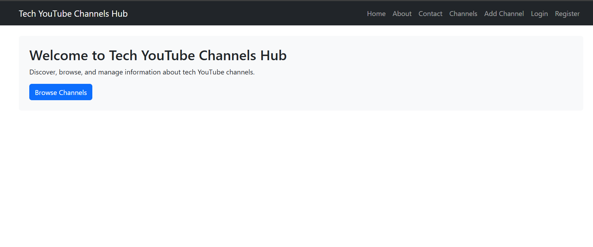
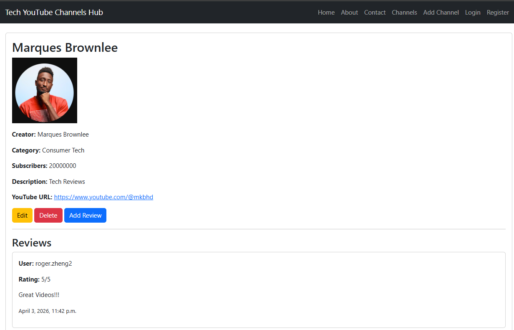

# Tech YouTube Channels Hub

Tech YouTube Channels Hub is a Django-based website for discovering, browsing, and managing information about tech YouTube channels.

## Features

- Browse a list of tech YouTube channels
- View detailed information for each channel
- Add, edit, and delete channels
- Upload channel images
- Search channels by name
- User login, logout and register
- Leave reviews and ratings on channels
- Contact page
- Bootstrap-based layout
- Django admin panel for management

## Project Structure

- `core` - home, about, and contact pages
- `channels` - channel models, views, forms, and CRUD features
- `reviews` - review model and review creation
- `accounts` - authentication routes

## Screenshots

### Home Page



### Channels Page


### Channel Detail Page




## Run the Project

After cloning the repository, run (note db.sqlite3 is empty):

```bash
cd tech-youtube-channels-hub/project02_root
python -m venv .venv
source .venv/Scripts/activate
python -m pip install django pillow
python manage.py migrate
python manage.py runserver
